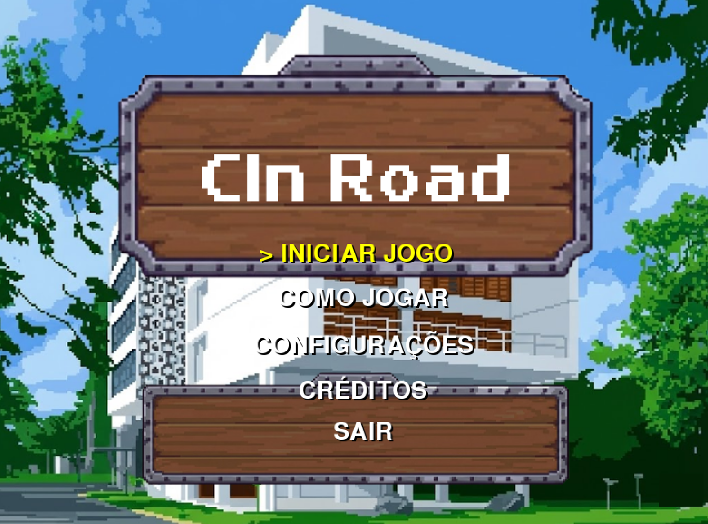
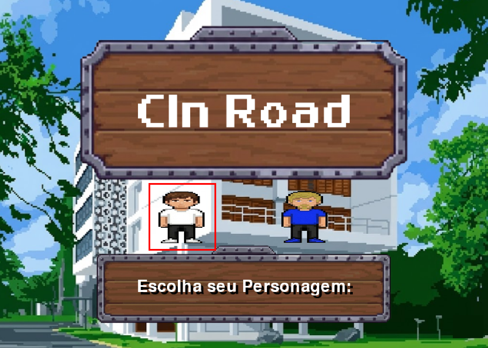
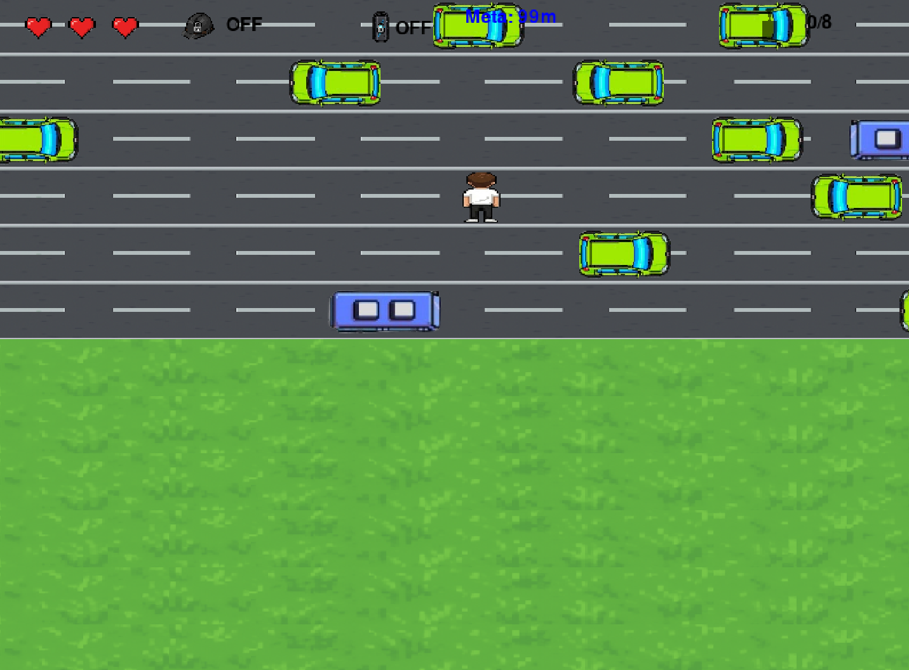

# 🎓 CIn Road: Rumo ao Diploma

> **Projeto da disciplina de Introdução à Programação (2025.2)**
> **Instituição:** Centro de Informática (CIn) - UFPE

## 👥 Equipe de Desenvolvimento
| Nome | Login | Email |
|------|-------|-------|
| Davi de Souza Mello | `dsm5` | dsm5@cin.ufpe.br |
| Davi Rosendo Carvalho | `drc4` | drc4@cin.ufpe.br |
| Gabriel Godoy Carvalho de Menezes | `ggcm` | ggcm@cin.ufpe.br |
| João Felipe Costa Neves | `jfcn4` | jfcn4@cin.ufpe.br |
| João Pedro Medeiros | `jpmmm` | jpmmm@cin.ufpe.br |
| Vitor Costa Nunes | `vnsfc` | vnsfc@cin.ufpe.br |

---

## 📝 Sobre o Projeto
**CIn Road** é um jogo de ação e estratégia 2D desenvolvido em Python com a biblioteca **PyGame**. Inspirado no clássico *Crossy Road*, o objetivo é guiar um estudante do CIn em uma jornada desafiadora até o diploma.

O jogador deve avançar por um mapa gerado proceduralmente, desviando de **ônibus circulares**, **carros** e **obras**, enquanto gerencia seus recursos coletando **fragmentos de crachá** (pontuação), **energéticos** (efeito de câmera lenta) e **escudos** (proteção contra dano).

O sistema foi construído rigorosamente sobre o paradigma de **Orientação a Objetos**, garantindo código modular e extensível.

---

## 📂 Arquitetura do Projeto
O código foi organizado utilizando **Modularização** para separar responsabilidades e facilitar o trabalho em grupo. A estrutura de arquivos final é:

```text
projeto/
│
├── main.py                  # Classe Game: Gerencia o loop principal, estados (Start, Playing, GameOver) e eventos.
├── src/
│   ├── config.py            # Centraliza constantes (tamanho da tela, cores, FPS, distância da meta).
│   └── entities/
│       ├── entity_base.py   # Classe Mãe (Entity): Define imagem, rect e posição para todos os objetos.
│       ├── player.py        # Classe Player: Lógica de movimento em grade, animação de sprite e sistema de vidas.
│       ├── obstacles.py     # Classe Obstacle: Lógica de tráfego, direção e velocidade variável.
│       └── collectibles.py  # Classes Itens: BadgeFragment, EnergyDrink e Shield (Polimorfismo).
└── assets/                  # Imagens e Sons
```
---

## Capturas de tela







---

## Conceitos de POO aplicados: 
Herança:

Criamos a classe Entity que herda de pygame.sprite.Sprite.

Player, Obstacle e Collectible herdam de Entity, reaproveitando atributos como image e rect.

Polimorfismo:

Classes filhas implementam comportamentos distintos para métodos comuns (ex: o método update() do Player responde ao teclado, enquanto o dos Obstáculos responde a uma velocidade automática).

Encapsulamento:

A classe Game centraliza e protege o estado do jogo (pontuação, vidas, mapa), impedindo acesso direto indevido de outras partes do código.


---
## 🛠️ Ferramentas Utilizadas

* **GitHub**
* **Git**
* **PyGame**
* **VS Code**
* **Gemini**
* **Canva**


---
## 🤝 Divisão do Trabalho

A equipe foi organizada da seguinte forma:

* **ÁUDIO E IMAGENS:** Davi Rosendo
* **BACK-END:** João Felipe e João Pedro
* **FRONT-END:** Vítor e Gabriel Godoy
* **SUPORTE GERAL:** Davi Mello


--

## 🚧 Desafios, Erros e Lições Aprendidas
1. Qual foi o maior erro cometido durante o projeto? Como vocês lidaram com ele?
Erro: O gerenciamento de caminhos de arquivos (assets). Inicialmente, o uso de caminhos relativos simples ou absolutos fazia o jogo "quebrar" quando executado em computadores diferentes (Windows vs Mac/Linux ou pastas diferentes).

Solução: Implementamos uma função robusta de carregamento (load_ui_images) utilizando a biblioteca os.path.join. Além disso, adicionamos tratamento de erros (try/except) que gera formas geométricas coloridas (placeholders) caso uma imagem não seja encontrada, impedindo o fechamento abrupto do jogo.

2. Qual foi o maior desafio enfrentado durante o projeto? Como vocês lidaram com ele?
Desafio: A sincronização de movimentos (Grid vs. Pixel). O jogo mistura duas lógicas: o personagem se move em uma "grade" fixa (pulos discretos), enquanto os carros e o cenário rolam suavemente por pixels. Isso gerava conflitos visuais na detecção de colisão.

Solução: Separamos a lógica em duas camadas: atributos grid_x/y para a posição lógica no tabuleiro e rect.x/y para a renderização visual. A colisão foi refinada ajustando as hitboxes para serem levemente menores que as imagens, garantindo uma jogabilidade mais justa.

3. Quais as lições aprendidas durante o projeto?
Organização é Vital: A divisão clara das tarefas (Front/Back/Áudio) evitou que todos mexessem no mesmo arquivo ao mesmo tempo, reduzindo conflitos no Git.

Estados de Jogo: O uso de uma "Máquina de Estados" (MENU, PLAYING, TUTORIAL) facilitou muito a implementação de novas telas sem transformar o código em um espaguete de if/else.

---
## 🎮 Como Rodar o Jogo
1. Clone o repositório: git clone [https://github.com/davi01mello/projeto_ufpe_road]
2. Instale as dependências: pip install pygame opencv-python
3. 3. Execute: python main.py


--
